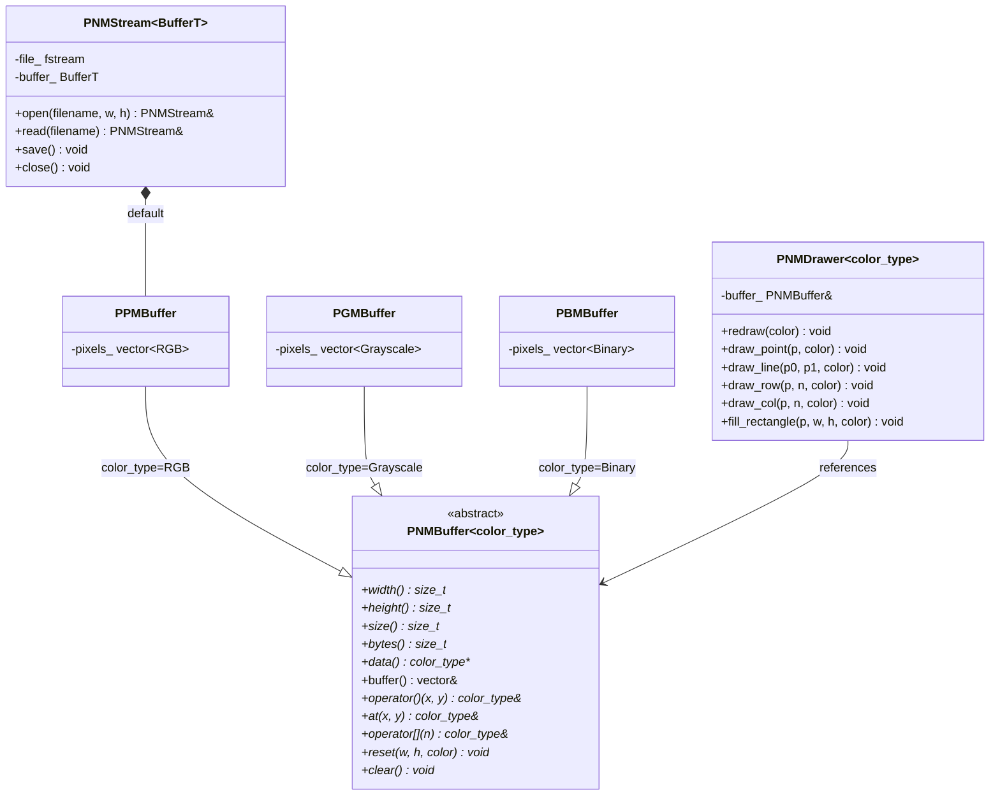
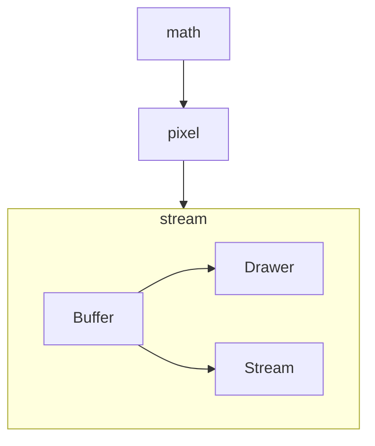

# PPMStream

> **版本** v0.2.0 | **标准** C++17 | **依赖** 无（仅使用 C++ 标准库）

一个零依赖的 C++ 库，用于 PNM 格式（PPM / PGM / PBM）图像文件的读写、像素缓冲区管理以及光栅绘图。

---

## 特性

| 模块 | 描述 |
|------|------|
| **PNMBuffer\<T\>** | 抽象像素缓冲区模板，统一 `operator()` / `at()` / `[]` 接口 |
| **PPMBuffer** | RGB 像素缓冲区，P6 格式 |
| **PGMBuffer** | 灰度像素缓冲区，P5 格式 |
| **PBMBuffer** | 二值像素缓冲区（展开存储），P4 格式 |
| **PNMStream\<T\>** | 泛型 PNM 流模板，自动适配三种格式（PBM 读写时特化打包/解包） |
| **PNMDrawer\<T\>** | 泛型绘图器（点/线/矩形/Bresenham），操作任意 PNMBuffer |
| **Pixel 类型** | RGB / RGBA / Grayscale / Binary + Point / Pixel |
| **math** | Vec（vec2/vec3/vec4）/ Mat（mat2/mat3/mat4）模板 |
| **构建系统** | CMake + Makefile |
| **测试** | ✅ 92 tests, 15 suites（Google Test） |

---

## 项目结构

#### 完整模块文档参见 [docs/CONTENTS.md](docs/CONTENTS.md)。

```
PPMStream/
├── include/pnmstream/
│   ├── math/                  # Vec.hpp Mat.hpp          —— 向量/矩阵
│   ├── pixel/                 # RGB.hpp RGBA.hpp ...     —— 像素模型
│   └── stream/
│       ├── buffer/
│       │   ├── PNMBuffer.hpp  # 抽象模板基类
│       │   ├── PPMBuffer.hpp  # P6 RGB
│       │   ├── PGMBuffer.hpp  # P5 灰度
│       │   └── PBMBuffer.hpp  # P4 二值
│       ├── PNMDrawer.hpp      # 泛型绘图器
│       ├── PNMStream.hpp      # 泛型 PNM 流
│       └── OpenMode.hpp       # 打开模式枚举
├── src/stream/                # 非模板实现源文件
├── tests/
│   ├── test_Math.cpp          # 数学类测试（27 tests）
│   ├── test_Pixel.cpp         # 像素模型测试（38 tests）
│   ├── test_PNMStream.cpp     # 流/缓冲区/绘图器测试（27 tests）
│   ├── CMakeLists.txt
│   └── Makefile               # 独立 Makefile，输出至 outputs/
├── examples/demo.cpp          # 示例程序
├── docs/                      # 模块文档
│   ├── CONTENTS.md            # 文档目录
│   ├── math.md                # Vec / Mat
│   ├── pixel.md               # RGB / RGBA / Grayscale / Binary / Point / Pixel
│   ├── buffer.md              # PNMBuffer / PPMBuffer / PGMBuffer / PBMBuffer
│   ├── drawer.md              # PNMDrawer
│   └── stream.md              # PNMStream / OpenMode
├── CMakeLists.txt             # 主 CMake 构建文件
└── Makefile                   # 主 Makefile 构建文件
```

---

## 核心架构



**设计原则**：

- **Buffer 抽象，Drawer 统一** — 不同 PNM 格式的核心差异在像素存储格式，Buffer 层封装这一差异，Drawer 只依赖抽象接口
- **无 Stream 继承** — Stream 层保持具体类模板，不设抽象基类
- **Buffer 是扩展点** — 新增格式只需实现 Buffer 子类，Drawer 自动适用

**PBM 读写特化**：`PBMBuffer` 内存中 1 像素/元素（展开），`PNMStream<PBMBuffer>` 的 `read()` / `save()` 通过 `if constexpr` 自动进行文件层面的打包/解包转换（P4 格式：8 像素/字节，MSB 优先）。

---

## 构建

### CMake

```bash
cmake -B build -DCMAKE_BUILD_TYPE=Debug
cmake --build build
ctest --test-dir build          # 运行测试
```

### Makefile

```bash
make all                        # 构建 lib/libpnmstream.a + outputs/pnmstream_demo
make test                       # 构建并运行测试（tests/outputs/）
```

---

## 快速开始

```cpp
#include <pnmstream/stream/PNMStream.hpp>
#include <pnmstream/stream/PNMDrawer.hpp>

using namespace pnmstream;

// PPM (RGB) — 写入
{
    PNMStream<PPMBuffer> ppm("output.ppm", 800, 600);
    auto& buf = ppm.buffer();
    buf(100, 200) = RGB::red();
    PNMDrawer<RGB> drawer(buf);
    drawer.draw_line({0, 0}, {799, 599}, RGB::green());
    drawer.fill_rectangle({50, 50}, 100, 80, RGB::blue());
}   // close() 自动保存

// PPM — 读取
{
    PNMStream<PPMBuffer> reader;
    reader.read("output.ppm");
    auto color = reader.buffer()(100, 200);
}

// PGM (灰度)
PNMStream<PGMBuffer> pgm("gray.pgm", 800, 600, 255, Grayscale{0x80});
pgm.close();

// PBM (二值)
PNMStream<PBMBuffer> pbm("binary.pbm", 800, 600, 1, Binary::white());
pbm.close();
```

---

## 类型别名

```cpp
// Vector
using vec2 = Vec<float, 2>;
using vec3 = Vec<float, 3>;
using vec4 = Vec<float, 4>;
// Matrix
using mat2 = Mat<float, 2>;
using mat3 = Mat<float, 3>;
using mat4 = Mat<float, 4>;
// Point
using PointI = Point<int>;
using PointF = Point<float>;
using PointD = Point<double>;
```

---

## 类型关系



---

## 待完成

| 优先级 | 任务 |
|--------|------|
| P3 | 图像变换（缩放 / 旋转 / 裁剪） |
| P4 | 抗锯齿（SSAA / MSAA）、三角形光栅化、画圆 |
| P4 | P3（ASCII PPM）格式支持、PAM 格式支持 |
