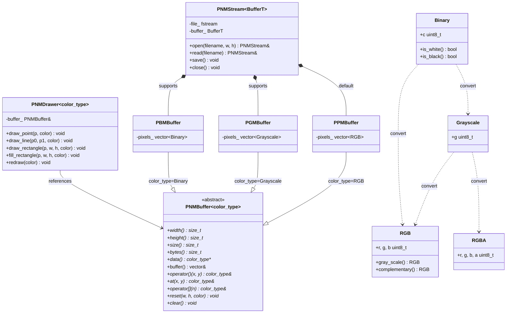

# PPMStream

> **版本** v0.5.0（开发中）
> **标准** C++17 · **依赖** 无（仅使用 C++ 标准库）

一个零依赖的 C++ 库，用于 PNM 格式（PPM / PGM / PBM）图像文件的读写、像素缓冲区管理以及光栅绘图。

## 特性

| 状态 | 模块 | 描述 |
|------|------|------|
| ✅ | **PNMBuffer\<T\>** | 抽象像素缓冲区模板，统一 `operator()` / `at()` / `[]` 接口 |
| ✅ | **PPMBuffer** | RGB 像素缓冲区，P6 格式 |
| ✅ | **PGMBuffer** | 灰度像素缓冲区，P5 格式 |
| ✅ | **PBMBuffer** | 二值像素缓冲区（展开存储），P4 格式 |
| ✅ | **PNMStream\<T\>** | 泛型 PNM 流模板，自动适配三种格式（PBM 读写时特化打包/解包） |
| ✅ | **PNMDrawer\<T\>** | 泛型绘图器，操作任意 PNMBuffer |
| ✅ | **Pixel 类型** | RGB / RGBA / Grayscale / Binary + Point / Pixel |
| ✅ | **math** | Vec / Mat 模板 |
| ✅ | **CMake 构建** | `CMakeLists.txt` 完整覆盖 |
| ❌ | **测试** | 测试套件待完善 |

## 项目结构

```
include/pnmstream/
├── math/                  # Vec.hpp / Mat.hpp
├── pixel/                 # RGB.hpp / RGBA.hpp / Grayscale.hpp / Binary.hpp
└── stream/
    ├── buffer/
    │   ├── PNMBuffer.hpp  # 抽象模板基类
    │   ├── PPMBuffer.hpp  # P6 RGB
    │   ├── PGMBuffer.hpp  # P5 灰度
    │   └── PBMBuffer.hpp  # P4 二值（展开存储）
    ├── PNMDrawer.hpp      # 泛型绘图器
    ├── PNMStream.hpp       # 泛型 PNM 流（含 PBM I/O 特化）
    └── OpenMode.hpp       # 打开模式

src/stream/buffer/         # PPMBuffer / PGMBuffer / PBMBuffer 实现
tests/                     # 测试
examples/                  # 示例程序
```

## 核心架构



**PBM 读写特化**：`PBMBuffer` 内存中 1 像素/元素（展开），`PNMStream<PBMBuffer>` 的 `read()` / `save()` 通过 `if constexpr` 自动进行文件层面的打包/解包转换（P4 格式：8 像素/字节，MSB 优先）。

## 快速开始

```cpp
#include <pnmstream.hpp>
using namespace pnmstream;

// PPM (RGB)
PNMStream<PPMBuffer> ppm("output.ppm", 800, 600);
auto& buf = ppm.buffer();
buf(100, 200) = RGB::red();
ppm.close();

// PGM (灰度)
PNMStream<PGMBuffer> pgm("gray.pgm", 800, 600, 255, Grayscale{0x80});
pgm.close();

// PBM (二值)
PNMStream<PBMBuffer> pbm("binary.pbm", 800, 600, 255, Binary::white());
pbm.close();
```

## 类型别名

```cpp
using vec2f = Vector<float, 2>;    using vec2  = vec2f;
using vec3f = Vector<float, 3>;    using vec3  = vec3f;
using vec4f = Vector<float, 4>;    using vec4  = vec4f;
using mat2f = Matrix<float, 2>;    using mat2  = mat2f;
using mat3f = Matrix<float, 3>;    using mat3  = mat3f;
using mat4f = Matrix<float, 4>;    using mat4  = mat4f;
using PointI = Point<int>;         using PointF = Point<float>;
```

## 待完成

- [ ] 单元测试
- [ ] 图像变换（缩放 / 旋转 / 裁剪）
- [ ] 抗锯齿（SSAA / MSAA）
- [ ] 三角形光栅化
