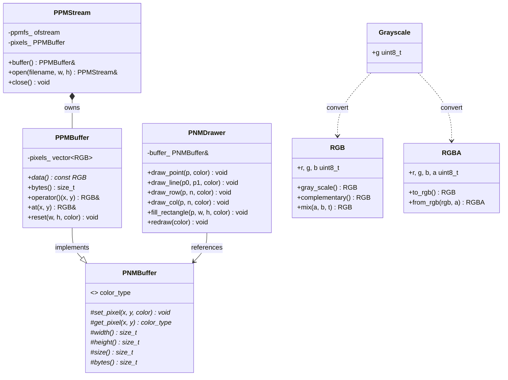

# PPMStream

> **版本** v0.2.0（开发中）
> **标准** C++17 · **依赖** 无（仅使用 C++ 标准库）

一个零依赖的 C++ 库，用于 PNM 格式图像文件的写入、像素缓冲区管理以及光栅绘图。

## 特性

| 状态 | 模块 | 描述 |
|------|------|------|
| ✅ | **math** | 向量和矩阵模板 |
| ✅ | **RGB / RGBA / Grayscale / Point / Pixel** | 像素与坐标类型 |
| ✅ | **PNMBuffer\<T\>** | 抽象缓冲区基类，统一 `set_pixel/get_pixel` 接口 |
| ✅ | **PPMBuffer** | RGB 像素缓冲区，继承 PNMBuffer |
| ✅ | **PNMDrawer** | 统一绘图器，操作 PNMBuffer |
| ✅ | **PPMStream** | PPM P6 二进制写入 + `ppm_file_info()` 元信息查询 |
| ❌ | **CMake 构建** | 目前使用手写 Makefile |
| ❌ | **测试** | 测试套件待完善 |
| ❌ | **像素数据加载** | 读取 PPM 文件像素数据 |
| ❌ | **扩展格式** | PGM/PBM/PAM |

## 项目结构

```
include/pnmstream/
├── math/                  # Vec.hpp / Mat.hpp
├── pixel/                 # RGB.hpp / RGBA.hpp / Grayscale.hpp / Point.hpp / Pixel.hpp
└── stream/
    ├── buffer/
    │   ├── PNMBuffer.hpp  # 抽象基类
    │   └── PPMBuffer.hpp  # PPM 实现
    ├── PNMDrawer.hpp      # 统一绘图器
    ├── PPMStream.hpp      # PPM 文件写入
    └── OpenMode.hpp       # 打开模式
```

## 类结构



## 快速开始

```cpp
#include <pnmstream.hpp>
using namespace pnmstream;

PPMStream ppms("output.ppm", 800, 600, 255);
PNMDrawer drawer(ppms.buffer());

drawer.draw_line({0, 0}, {799, 599}, RGB::red());
drawer.fill_rectangle({100, 100}, 200, 150, RGB::blue());
ppms.close();
```

## 类型别名

```cpp
using vec2f = Vector<float, 2>;  using vec2 = vec2f;
using vec3f = Vector<float, 3>;  using vec3 = vec3f;
using vec4f = Vector<float, 4>;  using vec4 = vec4f;
using mat2f = Matrix<float, 2>;  using mat2 = mat2f;
using mat3f = Matrix<float, 3>;  using mat3 = mat3f;
using mat4f = Matrix<float, 4>;  using mat4 = mat4f;
using PointI = Point<int>;  using PointF = Point<float>;  using PointD = Point<double>;
```

## 待完成工作

- [ ] CMake 构建系统（替换 Makefile）
- [ ] 单元测试
- [ ] PPM 像素数据加载（读取）
- [ ] 扩展格式（PGM/PBM/PAM）
- [ ] 图像变换、抗锯齿
